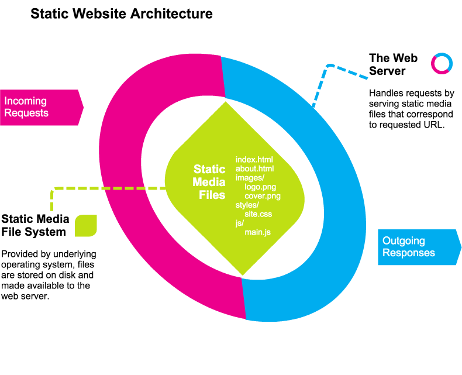
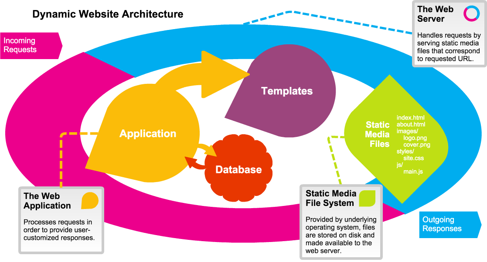
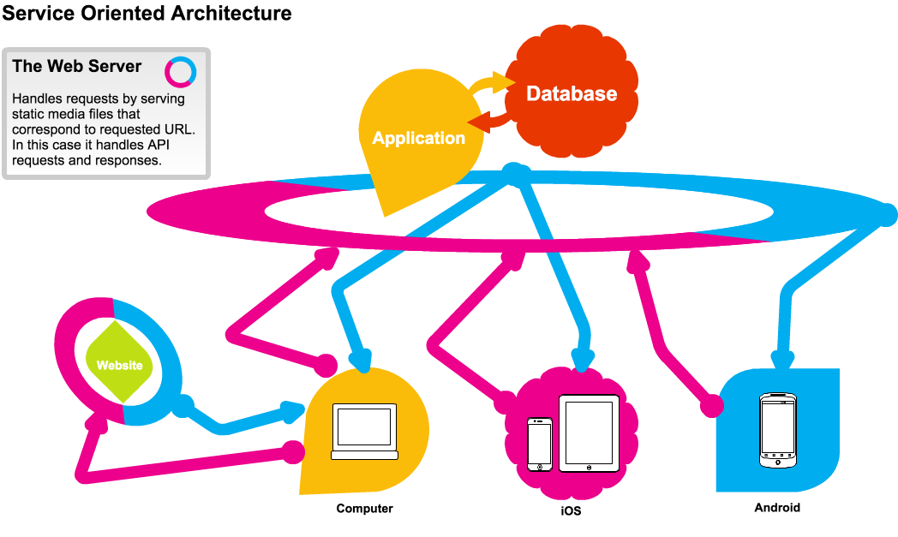

# Core Concept: Software Architecture

In software, the notion of "architecture" refers to the big-picture description of how the software is put together. This is a metaphor borrowed from other types of engineering, and we are probably more familiar with the term "architecture" as it relates to buildings. 

When a building is designed, the architect comes up with all the parts of the building. It needs doors, foyers, rooms, hallways, stairways, and more. It's the architecture of the building that determines where all the features of the building are located and how they interact.

Similarly, software architecture is about identifying the core pieces of the software and how those pieces will go together. For websites and web-based applications, this architecture includes the application that runs the site, the databases that store data, and the related components (such as load balancers or message queues) that allow the site to function. 

Software architecture is something that we can drill down into. We can talk about architecture at a site-wide level (the server, the database, the network), or we can talk about architecture at a simple component or app level (the parts of the app that handle different functions).

Throughout most of this book, we will discuss the architecture of a web application: What parts are involved in making the functionality we desire? But before we get into the specifics of an application, it's useful to look at how websites are architected at a broader level. 

The summary [definition of software architecture from Wikipedia](https://en.wikipedia.org/wiki/Software_architecture) is a good one: Software architecture is "the high level structures of a software system, the discipline of creating such structures, and the documentation of these structures." When we think of this in relation to building websites, we often talk about "website architecture."

## Types of Website Architectures
There are many ways to build a website or webapp. For convenience, we will group architectures into three major styles of website architecture.

### Static Website Architecture
In the simplest terms, a website can be a collection of files that do not change when people access them. These could be files of all types, including documents (such as html, xml, or docx files), media files (such as video, audio and images), or any other digital file. A web server can allow access to a hierarchy of files and directories and can serve up whatever media the user requests. Typically, a web server displays the "index.html" file in any given directory the user requests, which allows for the "index" files to serve as "homepages" for the content.

This form of website is simple and limited in terms of dynamic qualities we have come to expect (like favoriting or commenting on content). However, it is the primary use case the web was designed for: Serving content that can be referenced by a single, authoritative location (the URL). Serving static media works well with all of the different caching and performance mechanisms of the web, too, so static content tends to get to users quickly and reliably.

In fact, serving static content is so popular that there are several solutions, such as Jekyll and Pelican, that allow for content to be rendered to a static form for deployment to a static media server (such as Github Pages). Other services, which can be used via Javascript on the client side, may add features such as commenting or favoriting via the use of a third-party API.

Even in this modern era of web development, static media websites are more vibrant than ever, and there is more than can be done with them than ever before. They have also remained popular with a large group of web developers, which has insured a vibrant community.

### Dynamic Website Architecture
Most modern websites react to the user in some persistent way. By default, the web is "stateless"--web servers, for example, do not remember previous requests you made. They respond only to the data sent in the current request. However, we have become used to websites that allow us to login and customize content, save our favorites, share with friends, or comment on what we see. All of these features, and many others, require the addition of several functions that are not supplied by the web server, such as databases, logical processing of code, etc.

We call the websites that allow you to create an account and have some kind of customized experience "dynamic websites". They are websites that change per user and they typically store information about the user and what she has done over time.

In order to build a dynamic website it's necessary to combine several different layers:

<ul>
<li><strong>The web server</strong> still handles receiving and sending requests from clients, but now it hands those requests off to an application that determines how to respond to the user.</li>
<li><strong>The application</strong> is written in some backend programming language (such as Python, Ruby, PHP, Java, etc.), and each application will have it's own software architecture it uses to parse the request and create a response.</li>
<li><strong>The database</strong> is where the application stores persistent data such as user profiles, lists of favorites, comments on articles, etc. The application pulls data from the database in order to process the user's request.</li>
<li><strong>The templates</strong> provide a standardized formatting for the response. They are typically processed by the application to generate files that contain HTML, CSS and Javascript, which is sent to the user in the form of an HTTP Response.</li>
<li><strong>The static media</strong> includes all the images, supporting Javascript libraries, videos, audio and other binary files that do not get parsed by the application before being sent to the user.&nbsp;</li>
</ul>

These are the basic components of a dynamic website, but keep in mind that many dynamic websites and applications have many more components. Sometimes in order to bring your unique product to the user, it may be necessary to invent a whole new component. In other situations, you might make use of additional components to help improve website performance or to facilitate entirely new kinds of features.

### Service-Oriented Architecture
Although dynamic websites have the great advantage of being friendly to all sorts of development, they have the tendency to become very unique to their operational environment and it tends to become difficult to leverage the valuable functions in the website and application across different platforms. As the desire has grown to support as many different platforms as possible, and as web technology has spread to all sorts of devices, it has become more and more important for us to deliver unique "frontend" components to each client and reuse the functional "backend" components across all the different platforms.

In order to accomplish this goal, we must separate the frontend component that gets delivered to the user's browser from the backend component that performs the business logic of our application. The backend component is turned into a "service" which means that rather than presenting a beautiful frontend for the user, the service will present an Application Programming Interface (API) that can be leveraged by any client. APIs allow two different applications to communicate and exchange data. APIs will be discussed further on the next page, but for now the important thing to keep in mind is that the API will allow our frontend app to talk to our backend service and use all the features that were previously only available to the web application in the Dynamic Website Architecture.

By reconfiguring the architecture like this,we decouple the business logic and data storage parts of our application from the presentation of the software to the user. This allows, for example, a website and a native mobile app to leverage the same set of functionality via the same API. New features can be developed at the API level, and then for each individual client in a way that makes sense for the business and product. Features can also be included and excluded on a per-platform or per-device basis. A huge degree of flexibility is achieved while enhancing maintainability and extensibility.

Many, if not most, large websites and webapps are currently using a Service Oriented Architecture. The complexity of these systems can vary dramatically depending on need and scale, but the core concept of isolating components into dedicated applications and then providing APIs to allow communication between the applications is a key pattern in modern web development.