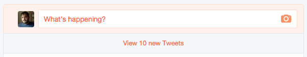
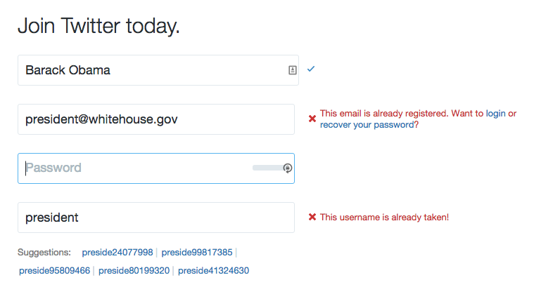

# Core Concept: Visual Feedback
As a user interacts with our software (website, application, game, etc.), they cause changes to happen in the system. The user might search for a city and then request the weather forecast for that city. They might search for a word and receive a set of data back from a dictionary API. They will undoubtedly interact with whatever features we have built for them, and that will causes changes in the system.

It might seem obvious to state that those changes are meaningless unless we actually show the results of those changes to the user. If we do not display the weather forecast or list of definitions for a word, then the user will find no value in using our software. So it is obvious that we need to actually show the information, but what is less obvious (especially as we begin our practice as web developers) is how important the visual presentation of that information can be in helping the user both succeed at using our software and enjoy the experience.

There are many people in the world who aim to write software that people need. In many cases, being the first person to create a software tool has guaranteed a successful project. But as competition increases, as problems become more complex, and as users become more savvy, it takes more than simply performing the task to make a successful software project. It is important to use all of our tools and abilities to increase user engagement and appreciation of the tool, and that is the direct result of building a tool that better serves the user.

## Interface Design
Providing the user with a pleasurable and useful experience relies on a solid interface design. This should always be the first place we begin to consider the user's needs and how the software we are building fits into their larger experience (both online and off). It might be that our site will primarily be used by users on mobile devices or tablets. It might be that one portion of the tasks our users want to perform will be completed in the office computer, and another portion of those tasks will be completed on mobile devices. There are myriad possibilities for how our software will fit into lives, processes, and workflows beyond the screen (and another myriad for how it will interact with those same things "within" the screen, too).

For our purposes here, we will focus primarily on improving the visual feedback of our software through messaging and animation. However, both of those things rely on already having a sensible approach to the interface. And all of these techniques and thoughts go hand-in-hand, so it's important to do our best to think about them in relation to each other.

Here are some general tips that will help us make better use of messages and animation in our projects:

* Use proper HTML structures to contain information. Use specific structures where possible (e.g. lists, asides, headers, footers), and respect proper tag nesting and hierarchy rules.
* Organize information into distinct areas contained within parent elements. (This becomes very easy to do if we are building our pages from distinct components, each of which handle one specific set of data or feature.)
* Use "wrapper" elements (e.g. `div` or `span`), or use containers like list elements (e.g. `ul` and `ol`), to contain information and create a logical hierarchy.

## Messaging
In web applications, being able to let the user know about changes to the system they are using is a critical aspect of designing a responsive, friendly system. In order to communicate changes that may not be possible to represent more clearly to the user through any other means, we often use "messages". Messages come in many shapes and sizes. The "loading throbber" that we see when loading data in software is a form of message. There are global messages, local messages, and all different styles and conventions of displaying messages. 

Sometimes messages are called "alerts" or "notifications." Sometimes they are called "toast" or "flash" messages. All of these words indicate a slightly different take on the use and approach to displaying messages. There are many ways to accomplish the goal of explicitly informing our user about the state of the system, and in Vue.js we have many different available methods to approach this problem. Before we get too deep into a specific implementation of messages on our website, let's consider some general characteristics of how we use messages in software.

There are many ways to use messaging in websites and apps, and developers are always coming up with clever new ways to indicate changes in content and system status. But a few conventions have grown up around messaging, and it's worthwhile to be aware of these guiding principles.

When generally thinking about messaging, the different varieties can be usefully categorized as one of two types: global and local. These are useful labels, and most software makes use of both types of messages at different times. Understanding when to use which type is important for using messages effectively in our application.

### Global Messages
Global messages apply to everything the user is seeing. On Twitter, for example, as we read tweets in our timeline we may notice an alert that shows up at the top of the timeline telling us that there are a number of new tweets available to read. In many email clients, when we receive a new message, or when ew file a message away, we will see an alert at the top of the screen. 

 New tweets!

Global messages are great for letting us know that things are happening that generally apply to what we're doing. Depending on how they are presented, they can be more or less effective. For example, the alert pictured above is only visible when we scroll to the top of the page. If we are lower on the page, we will never know how many tweets you have.

### Local Messages
Local messages appear closer to "where the action is". This is commonly seen in form field validation, especially when we're filling out more complex forms. In order to indicate where we have gone wrong, messages may be shown very close to the field (or in some way even styled as part of the form field).

Here is an example from Twitter's signup form:

 Twitter signup with error notifications

As we can see in the image above, as we fill in the form the Twitter website is checking to see if our information is valid. It indicates to us clearly if we have successfully filled in the field or if we must change our information. Twitter even goes so far as to suggest alternate usernames based on the data we've filled in when our chosen name is unavailable.

Local messages are also often used in locations where data is being loaded. We often see loading "throbbers" (those spinning or pulsing animated icons that are used to indicates something is happening) in the location where a specific set of data will be loaded. We see these loading indicators in sidebars where related articles will be listed, and we see them in image or video viewers as the media files are loaded. Since our applications tend more and more to be assembled from small components, each of which might make its own request to a remote API server, these location-based loading messages are likely to remain common.

## Meaningful Animations and Transitions

One of the side-effects of writing highly performant Javascript applications is that when we change the data on the screen it can be difficult for users to notice the alterations. It's not at all uncommon when working with an unstyled app for even developers, bleary-eyed from looking closely at code, may miss that a value has changed in a corner of the screen.

In order to make it more evident that changes are happening on the page, we often turn to animation. Humans are very good at noticing even small movements, especially if everything else on a page is generally stationary. We can animate position, size, color, and shape to help us draw attention to whatever we have changed.

Animations can help us show that an item has been added to a list, that an item which has been deleted is actively being removed, or that some information requires immediate attention. Animations help regain the feeling of "moving" through a website, which is somewhat lost when we abandon full page refreshes. Although the users appreciate the speediness of single page applications, they also find comfort in the indication that they are moving from one place to another. Transitional animations when replacing content on the screen help us give that feeling back to users.

By combining all of these techniques, we can create a much more enjoyable and understandable experience for users. We can prevent users from feeling confused about what just happened, and we can avoid the impression that our applications are not working by properly conveying information about loading and errors as needed. The more explicit and clear our applications and sites can be about what is happening in front of the user, the better the user experience will be.

